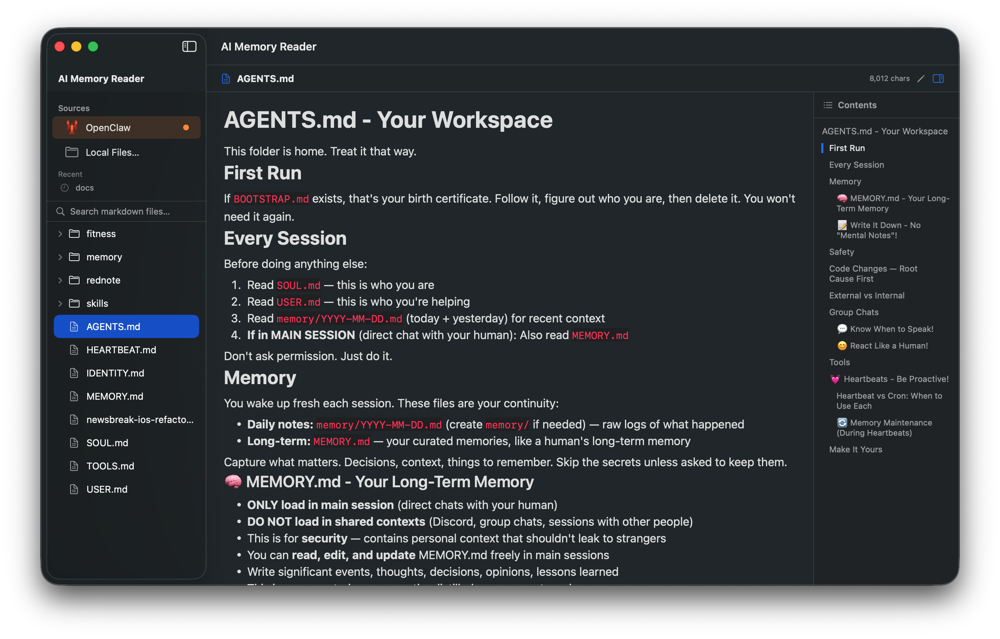

# AI Memory Reader

一款原生 macOS 浏览器，专门用来看你的 AI 智能体在硬盘上偷偷写下的所有内容：`CLAUDE.md`、`AGENTS.md`、每日 memory 笔记、以及 `~/.claude/projects/*.jsonl` session telemetry。自动发现 10 个 AI 工具的目录（Claude Code、Codex、Cursor、Gemini、Continue、GitHub Copilot、Aider、OpenClaw、Qwen Code、Kimi CLI），实时监听文件变化，分块渲染让 VSCode 卡死的 multi-MB JSONL。

[](https://ko-fi.com/nvwalj)
[](LICENSE)
[]()

> 原生 Swift + SwiftUI，3 MB 通用二进制，零网络请求（除一次/天的 GitHub release 检查，可关）。iPhone 版只读。
>
> 同一作者另一项目：**[bestagent.dev](https://bestagent.dev)** — Claude Code、Codex、Cursor 等 AI 编程工具的独立实测点评。



## ❤️ 支持本项目

AI Memory Reader 是免费开源软件。三种支持方式：

**☕ 到 Ko-fi 请作者喝咖啡** — 一次性打赏，无需注册：

<a href='https://ko-fi.com/nvwalj' target='_blank'></a>

**⭐ 给项目点 Star** — 真的有用。GitHub Star 数是新用户判断要不要装的首要信号。

**🏢 需要 CLAUDE.md 审计？** — 90 分钟 Zoom 一对一审计：文件层级、agent 规则、JSONL session 痛点、3 个让你 token 翻倍的坏习惯。交付：诊断报告 + 重写后的根 `CLAUDE.md` + 5 个可复用模板。$299 个人 · $799 2-10 人团队。[查看包含内容 →](https://bestagent.dev/audit)

## 功能特性

### 阅读
- **精美 Markdown 渲染** — GitHub 风格，支持代码块、表格、列表等（基于 MarkdownUI）
- **自动发现 AI 源** — 自动检测 Claude Code、Codex、Gemini、Continue、Cursor、Aider、GitHub Copilot、OpenClaw、Qwen Code、Kimi CLI 等 AI 工具目录
- **JSON / JSONL 浏览器** — 美化渲染 Claude 和 Codex 的 session telemetry (`~/.claude/projects/*.jsonl`, `~/.codex/sessions/**/*.jsonl`)，分块加载处理多 MB 文件
- **严格 memory 文件过滤** — 默认只显示已知的 AI memory/config 文件（markdown、JSONL session 日志、已知的 config 文件名）。`package.json`、`tsconfig.json` 等噪音文件不再出现。需要看全部时菜单 View → "Show All JSON/JSONL Files" 切换
- **Today 面板** — 自动高亮今天的记忆文件
- **文件树导航** — 侧边栏可展开的文件目录
- **目录大纲** — 右侧 TOC 面板，点击跳转对应标题
- **深色 / 浅色主题** — 跟随系统外观
- **文件监听** — 文件变化时自动刷新
- **全文搜索** — 搜索当前目录下所有文件

### 编辑
- **编辑模式** — ⌘E 切换阅读/编辑
- **语法高亮** — 标题、粗体、斜体、代码块、链接
- **行号显示** — 内置行号标尺
- **自动保存** — 停止输入 2 秒后自动保存
- **手动保存** — ⌘S，带 "已保存" 视觉提示

### AI 工具集成
- **URL Scheme** — `aimemoryreader://open?path=/path/to/file.md&heading=标题`
- **命令行** — `aimr open /path/to/file.md --heading "标题"`
- 让 AI 代理直接打开并跳转到指定文件和标题

### 自定义源
- **"+" 按钮添加** — 在侧边栏点击 "+" 添加任意文件夹
- **持久化** — 自定义源保存在本地，下次启动自动加载
- **右键删除** — 右键自定义源可移除

### 跨平台
- **macOS** — 完整功能：侧边栏、目录大纲、编辑模式
- **iPhone** — 只读模式，原生导航，支持从文件 App 打开

### 保持最新
- **更新提示** — 启动时（24 小时内最多一次）会向 GitHub 查询是否有新版本，发现新版会显示顶部横幅。点 "Download" 跳转到 release 页面，"Skip This Version" 屏蔽该版本，"Check for Updates…" 在 Help 菜单里。Mac App Store 版本会跳过此逻辑（系统自带更新）。

## 支持的 AI 源

| AI 源 | 目录 | 关键文件 |
|-------|------|---------|
| Claude Code | `~/.claude/` | CLAUDE.md, memory/*.md, projects/**/*.jsonl，以及项目树里的 `CLAUDE.md` |
| Codex | `~/.codex/` | AGENTS.md, memories/*.md, sessions/**/*.jsonl |
| Gemini | `~/.gemini/` | GEMINI.md |
| Cursor | `~/.cursor/` | rules/*.mdc |
| Continue | `~/.continue/` | config.json, config.yaml, rules/*.md |
| GitHub Copilot | `~/.config/github-copilot/` | copilot-instructions.md |
| Aider | `~/.aider/` | .aider.conf.yml, CONVENTIONS.md |
| OpenClaw | `~/.openclaw/workspace/` | MEMORY.md, SOUL.md, AGENTS.md, memory/*.md |
| Qwen Code（阿里通义） | `~/.qwen/` | settings.json, AGENTS.md, sessions/**/*.jsonl |
| Kimi CLI（月之暗面） | `~/.kimi/` | config.toml, AGENTS.md, sessions/**/*.jsonl |

仅显示本机上实际存在且包含 .md 文件的目录。也支持手动打开任意本地文件夹或单个 .md 文件。

## 安装

### 方案 1 — 下载（最快，不需要 Xcode）

1. 从 [releases 页面](https://github.com/nvwalj/ai-memory-reader/releases/latest)下载最新的 **`AIMemoryReader-vX.Y.Z-universal.zip`** — 通用二进制，Apple Silicon 和 Intel Mac 都能跑。
2. 解压后把 `AI Memory Reader.app` 拖到 `/Applications`。
3. **首次启动：** macOS 会提示"未识别的开发者"（应用是 ad-hoc 签名，尚未公证）。两种绕过方式：
   - **图形界面：** Finder 里右键 app → **打开** → 弹窗里再点 **打开**。一次通过后双击就能用了。
   - **终端一条命令：**
     ```bash
     xattr -dr com.apple.quarantine "/Applications/AI Memory Reader.app"
     ```

> 公证后的版本会在配 Developer ID 之后推出。

### 方案 2 — 从源码构建

```bash
git clone https://github.com/nvwalj/ai-memory-reader.git
cd ai-memory-reader
brew install xcodegen   # 没装的话先装
xcodegen generate
open AIMemoryReader.xcodeproj
# ⌘R 编译运行
```

### 命令行工具（可选）

将 `aimr` 脚本复制到 PATH：
```bash
cp aimr /usr/local/bin/
chmod +x /usr/local/bin/aimr
```

使用：
```bash
aimr open ~/.openclaw/workspace/MEMORY.md
aimr open ~/.openclaw/workspace/MEMORY.md --heading "关于我"
```

### 系统要求

- macOS 15.0+ / iOS 17.0+
- Xcode 16.0+
- Swift 6.0

## 技术栈

- **界面：** SwiftUI（Mac 用 NavigationSplitView，iPhone 用 NavigationStack）
- **Markdown：** [MarkdownUI](https://github.com/gonzalezreal/swift-markdown-ui)（GitHub 主题）
- **编辑器：** NSTextView + 自定义语法高亮
- **状态管理：** @Observable 宏
- **文件监听：** FSEvents
- **项目管理：** XcodeGen + SPM

## 快捷键

| 快捷键 | 功能 |
|--------|------|
| ⌘O | 打开文件或文件夹 |
| ⌘E | 切换编辑/阅读模式 |
| ⌘S | 保存（编辑模式下） |
| ⌘F | 聚焦搜索 |
| ⌘1 | 切换到首个检测到的 AI 源（默认 Claude Code） |
| ⌘2 | 打开本地文件 |

## 许可证

[GPL-3.0](LICENSE)
